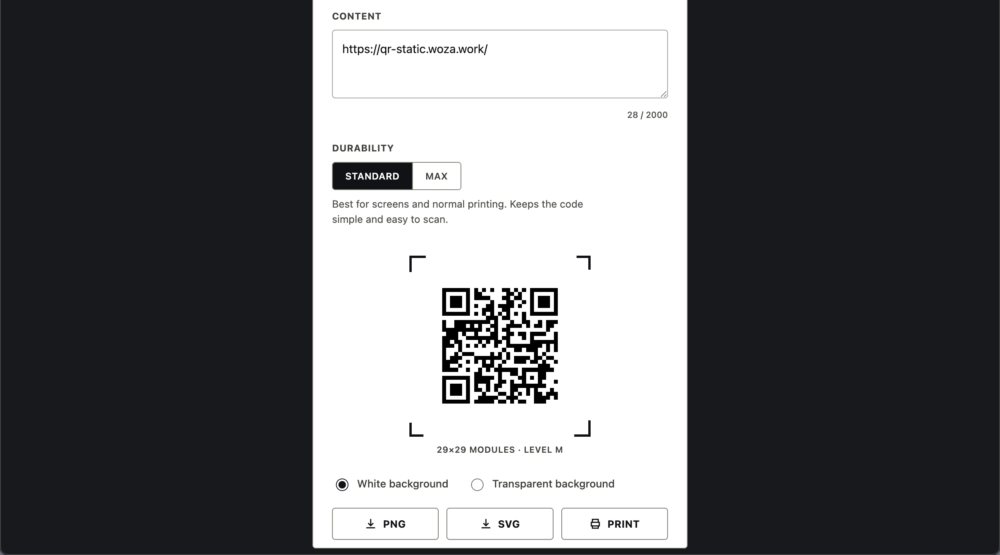

# Static QR Code Generator
A browser based offine desktop tool to create static QR codes and export them in PNG or SVG formats. Built for graphic designers, small businesses and non-profits who just want a quick and simple way to create QR codes locally.

Online demo - scan QR code below: 
https://qr-static.woza.work/

- Instantly create QR codes for websites, WiFi and other text.
- Offline-first single file web app.
- No installation needed. Simply download and double-click the index.html file to launch from your desktop. The app will open in your browser. 
- Private. No external server connections or tracking.
- Export QR codes as PNG or SVG.
- Supports transparent backgrounds.
- Supports multiple language scripts e.g. Thai, Kanji and Hindi
- Static QR Codes never expire.
- Minimalist UI.
- Mobile optimized.
- No Monetization/Dark Patterns - no advertisements, cookies, hidden tracking pixels, premium upgrades, or sign-up walls.
- Free and open source.

Feel free to share your thoughts and suggestions in the discussion forum above. If you find a bug or need more features, simply download the index.html file, then use Claude Sonnet 4.6 to to fix the bug or to create the features you want.

 

Minimalist UI

 

## Notes

- Will work well for typical "clear photo/screenshot of a QR code" use cases.
- Does not include any image enhancement features.
- May fail when QR images are noisy, blurry, tiny, damaged or low contrast.

 

### Related project

QR Decoder - Convert QR codes into text offline 
https://github.com/vbookshelf/QR-Decoder

 

## Revision History

Version 1.0 
20-June-2026 
Prototype. Released for testing.

 
